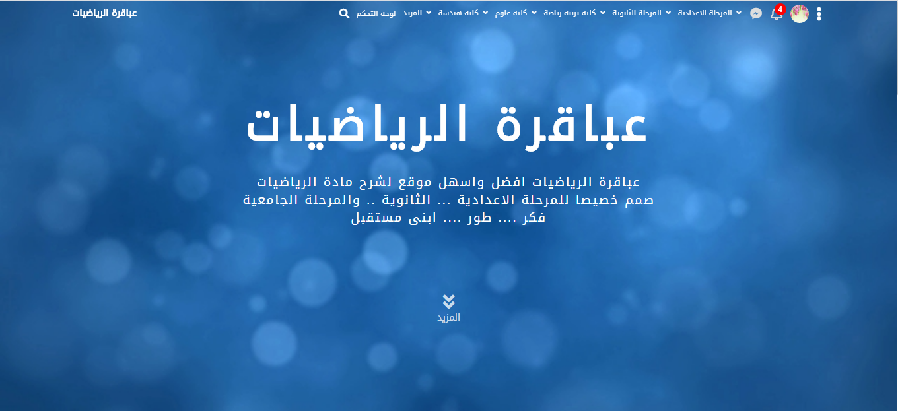

# Math-G
## educational website for learning mathematics

Math-G is Math education Website for primary, preparatory, secondary and University
the website contains 
* lectures
* videos
* images 
* exams
* and more

## Home Page

## Programming Languages
* Pure PHP
* MySQL
* HTML5
* CSS3
* Bootstrap3
* FontAwesome
* WoW.js

## How to use it?
* download the project
* install XAMP
* launch Apache and MySQL 
* copy the project in localhost 
* run the project using phpMyAdmin
